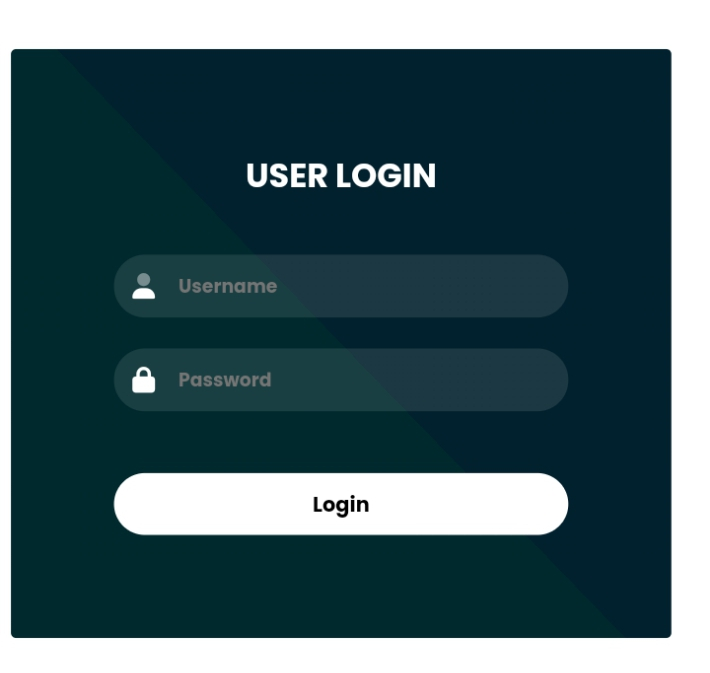

# Login Form

This project presents a login form created using HTML and CSS. It offers a simplistic yet effective means for users to authenticate their credentials.

## Preview

<a href="https://codebyfaisal.github.io/Loginform" target="_blank">Project Preview</a>

## Features

- **User-friendly Interface:** The login form provides a straightforward interface for users to input their credentials.
- **Validation:** Basic validation ensures that users enter necessary information before submission.
- 
## Technologies Used

- HTML
- CSS

## Future Improvements
- **Responsive Design:** The form is designed to adapt to various screen sizes, ensuring a seamless user experience across devices.
- 
## How to Use

1. Clone this repository.
2. Open the `index.html` file in your preferred web browser.
3. Input your credentials and click the login button to proceed.

Contributions and feedback are welcome!

If you have any questions or suggestions, feel free to reach out.

Happy Coding! 🚀
